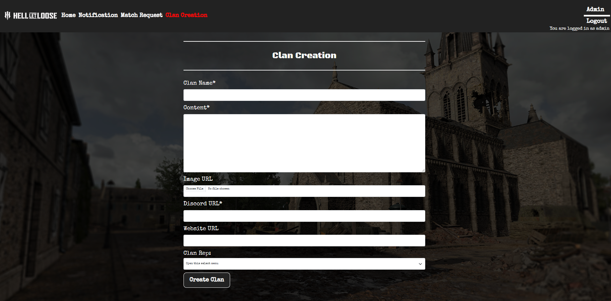

# Hell Let Loose Encylopedia


## About the Project

- I have created a website for a game called Hell Let loose. The game involves 2 teams of 50 players fighting against each other in a World War 2 immersive game, that can be played on a casual or a competitive level. As a result of the competitive side of the game, groups and clans have formed that play each other both on a competitive and a more friendly level. These clans have an organisation structure. They actively try to recruit new members and organise games against other clans, but none of this process is streamlined.

- The purpose of this website is to provide clan representatives with an area where they can both create a clan page to advertise their group and a channel through which they can contact other clan representatives to request games. It also provides a much needed service for the general user who can navigate around the website and seek out a clan to join. If they then find one that interests them, they can then investigate further by clicking on the clans discord link or the website link. 

[Live Website Link](https://hll-clans-encyclopedia-085b920e958c.herokuapp.com/)

## Target Audience

**What was the idea behind building the product?**

-	To allow users to have one location where they can search for hell let loose clans.
-	To allow users to get some detailed information about any specific clan.
-	To allow the user to be able to further research the clan by being shown the clans social network links.
-	Build an encyclopaedia style site. 
-	To allow clan representatives to be able to request games from other clans.
-	To allow representative from each clan to sign up and create an account on behalf of their clan.

**Who is the user?**

-	The user will be somebody of any age who has played hell let loose.
-	The user may be a regular player of hell let loose.
-	The user could  be either a casual or a competitive player.
-	The user will be seeking further information to help them  get more involved in the game.
-	The user will be looking to join a clan and is investigating the different options.
-	The user will already belong to a clan and be looking to recruit new members into the clan.


**What are the needs/wants of the users?**

-	A clan representative needs to be able to create a clan page
-	The clan representative needs to be able to write and add updates to  their  clan page as required.
-	The clan pages need to be visible and easily located.
-	The user will want the clan page to be clear and provide the relevant information.
-	Provided they create an account,  the clan representative will have  the correct level of access to make any changes required to the clan page
-	Clan reps they will have the ability to contact admin and raise a ticket to resolve any issues


**What are the needs/wants of the business?**

-	To create a website in an encyclopaedia style
-	The site should provide the user with a clear list of all the clans available in an A-Z format.
-	The site will be easy to navigate.
-	The site will contain a good balance of images and text.
-	The clan pages will be laid out in a way that keeps the user engaged.
-	For users who have signed up as a clan rep they will be given the correct permissions.
-	To keep traffic and user engagement, clan reps will be given the option to request games.
-	The system used to request games will be easy to use. 
-	The UI of the site will be seamless.


**How does the site meet the needs of the user and business?**

-	The website will be displayed in an encyclopaedia style. The front page will show an A-Z of the different clan names which will make it easy and simple to navigate 
-	By having it in encyclopaedia style, information will be available to the user straight away and will not require excessive searching.
-	The layout of the clan pages will be uniform across all pages to create a more professional looking site.
-	Clan representative will be have the required permissions to create the clan page and access to a support system with admin staff so any issues can be resolved in a timely manner.


## Scope

**what will the site include**

-	Description – there will be a section on the homepage that contains the rules of the site and how to create a clan page, request a game and raise a ticket with admin

-	Clan creation – both admin users and users who have signed up and created an account as a clan representative, will have the ability to create a clan which will give them full C.R.U.D access to the clan page

-	Clan page – users who view the site can see the different clan pages created

-	Match request – the ability for a clan rep to send a game request to another clan. This option is only  available to clan representatives and admin

-	Notifications tab – allows a clan representative and admin to see if they have a message from another clan representative, such as a game request or a ticket 

-	Sign up and log in – allows a user to sign up and log in either as a clan representative, basic user or admin

-	Administration system– create an admin /super user  

-	Ticket – create a ticket system for clan representatives or general users to contact admin

-	A-Z clan page directory – list of all the clans that have been created on the site


## Structure

### Site Map

- Below shows a breakdown of the website depending on the log in status of the user

**Admin user**

- Admin has access to edit and delete on any clan page


**Logged in user – clan representative**

- The logged in user only has access to edit and delete their own clan page


**Logged in user – non clan representative**
- The logged in user only has access to notifications


## Data Schema

- Below is the data schema that I have created for the website, there are 4 main databases that have been created.  

- User database:  this has been created to log and store the users that have registered for the site. A Boolean field is included in the database and is used throughout the site to check if the user is a clan representative as they have access to additional features. There is also a ‘memorable name’ section which is used for password reset. 

- Clan database: this has been created to store the clans that have been created. They are linked on a one to one connection with the users database as one user can only have one clan. It also links the clan database in a one to many relationship with the notifications.

- Notification database: this stores all the messages that have been created and sent.

- Matches database:  this has a many to one relation to the clan page as many different game requests can be raised which relate to a single clan.


## Skeleton

### Wireframe

- I created wireframes for each page of the website, showing how the site will appear both in mobile and browser format. 

**Homepage**


**Log in and out page**


**Clan Creation and Game Request**


**Clan Page**


**Notification Page**


**Individual Notification**


**Individual Game Request**


**Edit Clan Page**


**Raise Admin Ticket**


**Navigation Bars**

- Due to the different users, I also created different wireframes of the navigation bar, depending on the user’s log-in status


## Surface


**Images**

- Most of the images used when creating the game have been taken from the official hell let loose website eg the logo. 

- The images used on the clan pages were taken from the Individual Discord channels for the related clan

- Other images have been taken from external sources such as an artist who creates artwork related to Hell let loose


**Colour Scheme**

- The website was created using colours that are in keeping with WW2. All colours were checked to make sure they did not clash and had the correct contrast with one another.

- Text - #FFFFFF

- Header background - #222222

- Body Background - #595959

- Focus  - #ff0000 – used for hover effects and buttons


**Typography**

- The theme for this website was WW2 therefore the font style was selected to compliment that theme. 

- Both fonts are from google fonts:

  - Header font: Font header - Black Ops One - [Link](https://fonts.google.com/specimen/Black+Ops+One)

  

  - Main text font:  Font main - Special Elite - [Link](https://fonts.google.com/specimen/Special+Elite?query=Special+Elite+)

  


## Agile

Kanban Board Link - [Link](https://github.com/users/GMontaque/projects/4)

**Epics**

- During the design stage of my project, I decided on the different features, structure and strategy for the site, this was broken down for the project using the agile methodology to better understand how to complete the project and implement the necessary features. At the same time, this ensured that  the most important features were implemented first and that a deliverable product (minimum viable product) was created, even if some of the  features were not  completed within the set time. 11 EPICS were created and these were broken down into 68 user stories.

- Below is the list of the 11 EPICS which were created for this project.
  - EPIC 1: Project set up 
  -	EPIC 2 : Website and clan page navigation
  -	EPIC 3 : General User Comment Section
  -	EPIC 4 : Clan Webpage Creation
  -	EPIC 5 : Game Organisation
  -	EPIC 6 : User Authentication and Authorisation
  -	EPIC 7 : Database Management
  -	EPIC 8 : User Notification System
  -	EPIC 9 : Admin Management and Notifications
  -	EPIC 10 : Error Handling
  -	EPIC 11 : Website Testing


**User stories**

 - Once the user stories and epics had been created, the next stage was to break them down to understand which to prioritize and which could be left to be completed at a later stage. I used the MoSCoW prioritization technique to do this. This process works by giving each user story a score (story point) as to the estimated amount of effort required to implement the user story and then once implemented checked against the acceptance criteria. The story point number system uses something called the Fibonacci numbers, the reason for this is that the number sequence goes (1, 2, 3, 5, 8, 13, etc.), the benefit of which is that it allows for the different size of tasks. For example setting up a GitHub repository is a relatively easy task but styling a website is much more complex with a number of parts, which the Fibonacci numbers allows for.

- Each entry in the kanban board shows the MoSCoW prioritisation result.

- MoSCoW prioritization technique stands for:
  - Must-Have: Critical requirements that must be implemented for the project to be considered successful.
  - Should-Have: Important requirements that are not critical but add significant value.
  - Could-Haves: Desirable features that would be nice to have but are not crucial.
  - Won't-Have: Features that are explicitly excluded from the project scope.

- The total Story Points in the project is 240.
-	Must-Have : 110 story points
-	Should-Have : 73 story points
-	Could-Have : 57 story points
-	Wont-Have

**Mock Kanban Board**

- As referenced previously, when deciding on how to proceed, I first broke the user stories down using the MoSCow technique and then added a story point value to each user story. I went through a few iterations to decide on the order of completion. Having arrived at a satisfactory order, I completed the project over 6 iterations. 

[Excel Spreadsheet](https://docs.google.com/spreadsheets/d/158kUvL5gLR40iwjXMzUWyYzTrQp6--U38OAhn3ajcNQ/edit?gid=0#gid=0)

## Features

**Navigation bar**

- The navigation bar appears at the top of all pages within the website
- Before a user logs in. the navigation bar contains logo, home, register and login 
- For a clan representative user, the navigation bar updates to home, notification, match request, clan request and log out
- For a non-clan representative user, the navigation bar updates to home, notification and log out
- For an admin user the navigation bar updates to home, notification, match request, clan request, admin and log out
- When a link is moused over, it changes to red to show focus. Also, the link to the page which the user is currently on, will appear red on the navigation bar. 

- **Navigation bar**


- **Admin**


- **Signed In - Clan Representative**


- **Signed In - Non Clan Representative**


- **Mobile Navigation Bar**


**Footer**

- The footer appears at the bottom of all the web pages
- The footer contains official links for the hell let loose discord, website and a link to buy the game
- There are 2 other sections which contain the hell let loose logo and details regarding the admin team for the site


**Home Page**

- The page contains a header background image which is an image of one of the maps in the game together with the title of the website and some summary text
- Description section: this explains the website in more detail
- A-Z style list:  contains all the clan names with a uniform background image
- When hovered over, the  clan card displays a link so that the user can view the clan page in full


**User Registration**

- There is a link in the navigation bar which the user must click to get to the registration form
- The user must complete the form in full, providing a nickname, email address, password , memorable name and a tick in the checkbox if they represent a clan
- Once the form is submitted, a confirmation message appears confirming this and the user is  redirected to the homepage
- A confirmation message will appear to confirm that they are registered


**User Log In**

- There is a link in the navigation bar which when clicked , takes the user to the log in form
- The user must input their username and password
- Once logged in, they are taken back to the homepage
- A confirmation message appears to confirm that they are logged in
- Once logged in, a log out button appears in the navigation bar where the log in button was previously
- The Navigation bar will update with correct links based on the users access


**User Log Out**

- The log out link appears in the navigation bar when the user has logged in
- When clicked on, it takes the user to a webpage to confirm if they want to log out
- If the user clicks yes on the on-screen button that appears, they are  logged out
- A pop-up message appears confirming this and the user is  re-directed to the home page


**Raise game request**

- When either a clan rep or admin are logged in, a game request button appears in the navbar
- When clicked they are taken to a page with a form to raise a game request
- The form has several fields that they need to complete to raise a game request
- Checks will be carried out to make sure the form is fully completed
- Once completed the form is submitted and they are shown a message confirming the form is submitted as a pop up
- Admin user can raise a game request for any user against any clan


**Create Clan Page**

- When either a clan rep or admin are logged in, a clan creation link will appear in the navigation bar
- When clicked they are taken to a page with a form to create a clan
- The form has several fields that they need to complete to create a clan
- Checks will be carried out to make sure the clan name does not already exist and that the user does not already have a clan linked to the account
- Once completed the form is submitted and they are shown a message confirming the form submitted as a pop up
- If admin is logged in, they can create a clan for any user provided there is not one already linked to their account
- This is the C in C.R.U.D as the user with clan representative access or admin can create a clan page



**Notification Page**

- All signed in users will see a notifications link in the navigation bar
- When clicking on the notifications link as an admin user, it will show all games and inbound messages for all users
- When clicking on the notifications link as a clan representative, it will show all outbound messages and games related to them, split between game requests sent and received 
- When clicking on the notifications link as a non-clan rep, it will only show outbound messages to admin
- Each message and game requests has  a button next to it which when clicked, will display the full message in a separate webpage

**Admin notification page and ticket – inbound messages**

- When an admin user clicks on notifications, they will see all messages sent to them.
- Admin must click on the button link next to the message to view it in full
- When viewing the full message, they have the ability to update the status of the admin ticket to one of the following 3 options:  in-progress, accepted or cancelled.

**Admin Page**


**Admin Ticket Message**


**Raise Admin Ticket**


**Clan Representative and logged in user outbound messages**

- Clan representative and non-clan representative users will be shown the below notification page and outbound message section when they click the notifications link.
- They will see all messages they have sent out to admin
- These can be viewed by clicking the button next to each admin ticket raised
- Initially in table form, the outbound message will contain limited information 
- The user can view the full message. The status of the message is shown in the table and on the full admin ticket message

**Clan Representative Page**


**Non Clan Representative Page**


**Notifications – game request**

- Clan representatives and admin users have the ability to either accept or decline game requests
- Clan representatives can only do this for game requests that they have received 
- An admin user can accept or deny all game requests that have been sent
- A user can see all game requests sent and received from other clan users to them
- Initially the game requests will be displayed in a table form with limited information.

**Notifications – game request - Admin**


**Notifications – game request - Clan Representative**


**Upcoming games clan page**

- Each clan page has a section at the bottom which displays match requests
- These match requests will be games that the clan owner has agreed to play
- They will display the details of the upcoming game
- If a clan does not have any games that have been accepted, this section will not be displayed


**Clan page**

- When the user clicks on a link for one of the clan pages they will be taken to the full clan page
- The clan page displays the name of the clan at the top, below that and to the left, is the user linked to the clan and if the clan has a logo, it is placed to the right. 
- Below that is the main content of the clan page and either a discord or website link if they have a social media page.
- Below that are the edit and delete buttons for the clan page, which will only be visible for the user linked to the clan page and to admin
- This is the R in C.R.U.D as all users who visit the site are able to click on a clan page and view the full clan details


**Edit Clan Page**

- This is the page the user will see when they click the edit button
- Here, they can edit all the content of the page that would appear on the clan page
- There is also a section that allows users to upload images
- Before the form can be submitted, they must fill out all the relevant fields
- On submission, the logged in user’s name is checked to see if they are the clan owner or admin
- Once submitted a confirmation message will appear
- This is the R in C.R.U.D as the clan representative linked to the clan page and admin can update the content of the page


**Raise Admin Ticket**

- For logged in users, there will be a button that appears on the top left of the page
- When they click the button they are taken to an form
- The form will be partially pre-filled with the users username in the ‘From’ input and admin in the ‘To’ input
- The user can add in any text they wish into the text field before submitting  the form
- Validation has been included so that if nothing is entered in the text field, the form will not send

.

**Delete Clan Page**

- Here you can see the pop up that appears when the clan representative or admin clicks delete
- A 2 part check is carried out to confirm clan representative wants to delete clan
- The 2 part check stops accidental deletion
- This is the D in C.R.U.D as the clan representative linked to the clan page and admin can delete the clan page


## Future Implementations

- Search bar – this search bar will appear on the homepage and allow a user to input the name of a clan without having to search through them all
- Notification bar will change colour for unread messages – this feature would alert the user to a new notification as the notification link in the navigation bar would change colour to show that they have a new message
- Distinction between read and unread message – when a user looks through their messages they would be able to see which messages they had read and which they had left to check
- 2-way communication – the admin ticket system would be updated so that both admin and logged in users could communicate regarding a ticket that had been raised and submitted to the admin team
- Comments under clan pages – under each of the clan pages. a comments section would be added so that users with an account could leave comments regarding the clan

## Testing

- Please see External testing file for manaul testing result, automated testing and errors/bugs

[Link to test.md](testing.md)

## Technologies and Languages

- HTML: A markup language used to create the structure and content of web pages.
- CSS: A styling language used to control the layout and visual appearance of web pages.
- JavaScript: A programming language used to add interactivity and dynamic effects to web pages.
- Python: A high-level programming language used for web development, data analysis, and artificial intelligence.
- Django: A high-level Python web framework that enables rapid development of secure and maintainable websites.
- Github: A web-based platform for version control and collaboration on software development projects.
- Bootstrap: A popular front-end framework used to build responsive and mobile-first web applications.
- Heroku: A cloud platform as a service (PaaS) that enables developers to build, deploy, and scale web applications.
- Vscode: A lightweight, open-source code editor developed by Microsoft that supports a wide range of programming languages.
- Gitpod: A cloud-based development environment that provides a pre-configured and collaborative coding experience.
- SweetAlert: A JavaScript library used to create customizable and responsive alert messages and modal windows for web applications.

## Requirments.txt

- Following modules were used in creating the website

- asgiref==3.8.1
- cloudinary==1.40.0
- crispy-bootstrap5==2024.2
- dj-database-url==0.5.0
- dj3-cloudinary-storage==0.0.6
- Django==5.0.4
- django-allauth==0.62.1
- django-crispy-forms==2.1
- gunicorn==22.0.0
- psycopg2==2.9.9
- sqlparse==0.5.0
- whitenoise==6.6.0


## Deployment

### Deploy on Heroku:

- Log in to Heroku - or set up a new account.
- From the dashboard, click 'Create new app'.
- Name your app - it will need to be unique. Select Region, then 'Create'.
- Click on the 'Settings' tab.
- Scroll down to Config Vars and click 'Reveal Config Vars'.
- In the 'Key' field enter 'PORT', and in the 'Value' field enter '8000'.
- If there is a credentials file, this will also need to be entered into the Config Vars setting.
- Staying within 'Settings', scroll down to Buildpacks and click on 'Add Buildpacks'.
- Select 'python' first and click 'Save changes'.
- Then do the same again and this time select 'nodejs' and click 'Save changes'.
- Ensure the buildpacks are in the order of python first and nodejs second.
- Scroll to the top and select 'Deploy'.
- In 'Deployment method' select 'GitHub' and confirm you want to connect.
- Enter your GitHub repository into the search bar, and then 'Connect'.
- Under 'Automatic deploys', click on 'Enable Automatic Deploys' if you want the app to update every time you push changes to GitHub.
- Finally, click on 'Deploy Branch' under 'Manual deploy' to deploy your app. Once completed, you will be able to view your deployed link.

### Local Deployment

- Clone the Repository:
- Open the Project in Your IDE:
- Create a Virtual Environment: Open the terminal in your IDE and run:
- Activate the Virtual Environment: 
  - Windows: venv\Scripts\activate
  - macOS/Linux: source venv/bin/activate
- Install Dependencies: pip install -r requirements.txt
- Set Up Environment Variables: Ceate a .env file in the root directory and add the necessary variables:
```
SECRET_KEY=your_secret_key
DATABASE_URL=your_database_url
CLOUDINARY_URL=your_cloudinary_url
```
- Run the Development Server: 
```
python manage.py runserver
```

### Forking the Repository

- Click the "Fork" button found near the top right corner of the page. This duplicates the repository into your GitHub account.
- After forking, you will be redirected to your forked repository.
- If not already done, clone the forked repository to your local machine, using the instructions mentioned earlier.
- Make any desired changes or additions to the code in your local copy of the repository.
- Commit your changes to your local repository using the "git commit" command.
- Push your changes to the forked repository on GitHub with the "git push" command.
- If you intend to contribute your changes back to the original repository, initiate a pull request. You can do this by going to the original repository's page and selecting the "New pull request" button. From there, you can compare your changes to the original repository and request a merge.
- You now have a forked copy of the GitHub repository in your account, allowing you to make changes and contribute back to the original repository if desired.

### Cloning the Repository

- Log in to GitHub and locate the GitHub Repository.
- Under the repository name, click "Clone or download".
- To clone the repository using HTTPS, under "Clone with HTTPS", copy the link.
- Open Git Bash
- Change the current working directory to the location where you want the cloned directory to be made.
- Type git clone, and then paste the URL you copied in Step 3.
 ```
 $ git clone https://github.com/YOUR-USERNAME/YOUR-REPOSITORY
 ```
- Press Enter. Your local clone will be created.

Cloning a repository Offical - [Link](https://docs.github.com/en/repositories/creating-and-managing-repositories/cloning-a-repository#cloning-a-repository-to-github-desktop)


## Credit and Content

**Images**

  - Logo Image source - https://www.hellletloose.com/
  - 404 Page and Sign Out page Source - https://www.behance.net/gallery/111125123/Hell-Let-Loose-Fan-art
  - Background Image source - 

**Tutor Support**

- profile file

**Youtube Courses**

- django course