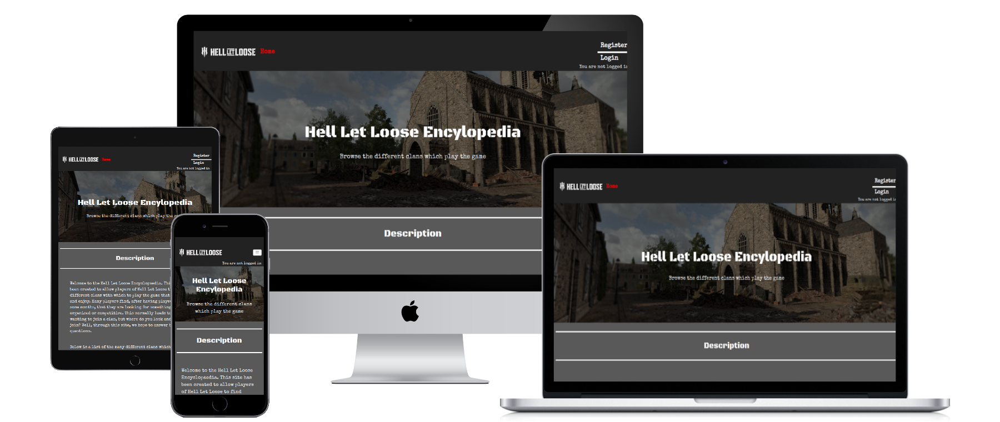

# Hell Let Loose Encylopedia

## About the Project

- I have created a website for a game called Hell Let loose. The game involves 2 teams of 50 players fighting against each other in a World War 2 immersive game, that can be played on a casual or a competitive level. As a result of the competitive side of the game, groups and clans have formed that play each other both on a competitive and a more friendly level. These clans have an organisation structure. They actively try to recruit new members and organise games against other clans, but none of this process is streamlined.

- The purpose of this website is to provide clan representatives with an area where they can both create a clan page to advertise their group and a channel through which they can contact other clan representatives to request games. It also provides a much needed service for the general user who can navigate around the website and seek out a clan to join. If they then find one that interests them, they can then investigate further by clicking on the clans discord link or the website link. 

[Live Website Link](https://hll-clans-encyclopedia-085b920e958c.herokuapp.com/)

