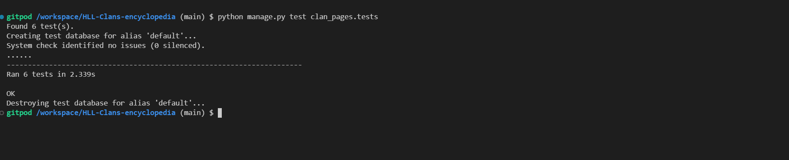
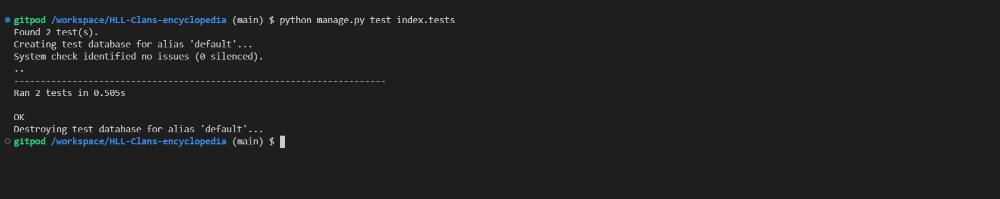
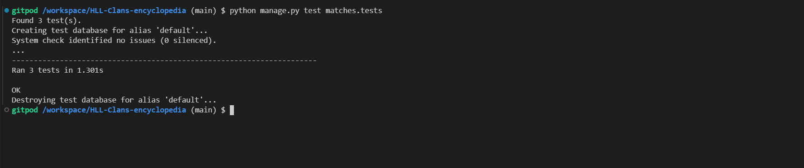
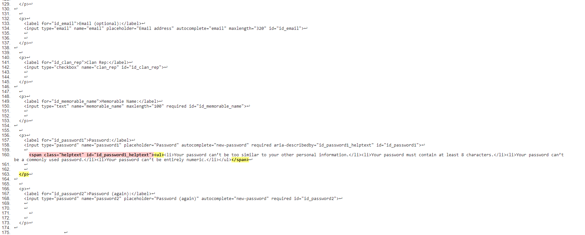
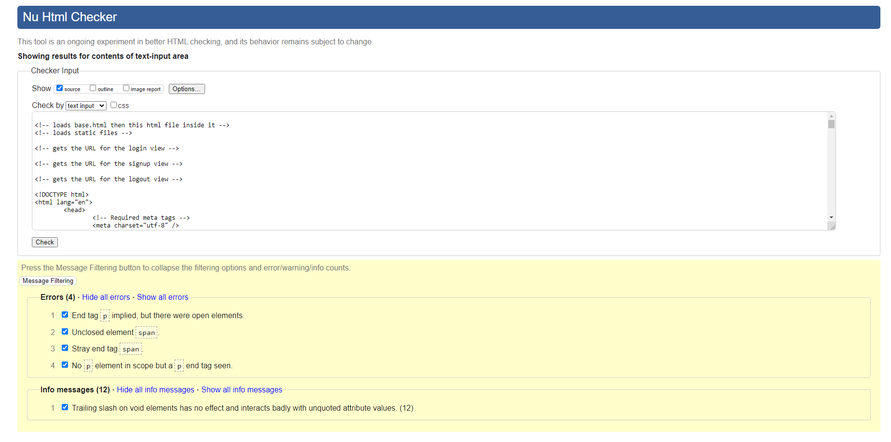
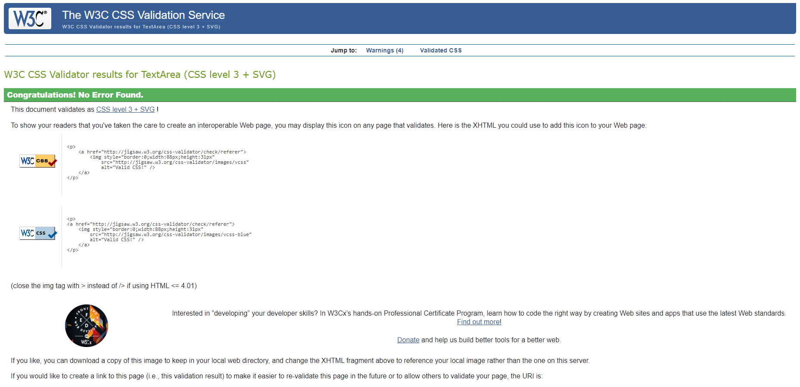
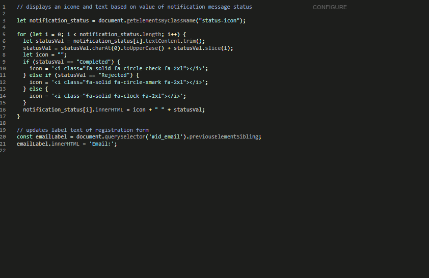
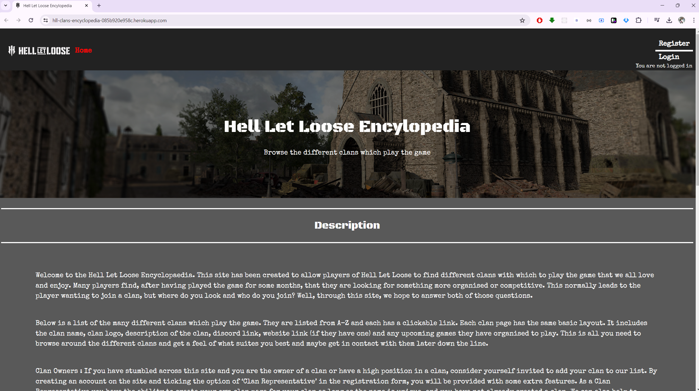
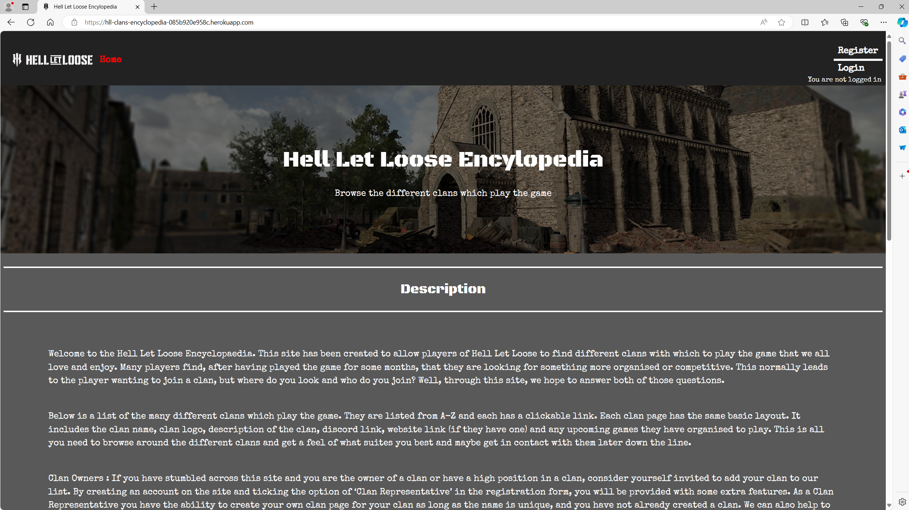
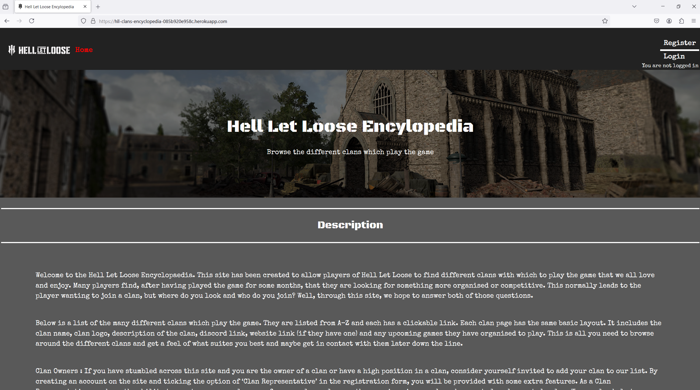

## Testing


### Manual Testing

- Below is a table showing all the manual testing that was carried out and the expected result

|     Feature being   tested                                          |     Test carried   out                                                                         |     Expected   outcome                                                                                                                                                                           |     pass    |
|---------------------------------------------------------------------|------------------------------------------------------------------------------------------------|--------------------------------------------------------------------------------------------------------------------------------------------------------------------------------------------------|-------------|
|     Webpage loads   showing index.html page                         |     Enter URL   address of website                                                             |     Index.html   page loads                                                                                                                                                                      |     pass    |
|     Navbar hover   effect                                           |     Mouse over   navbar links and then move mouse away                                         |     All   navigation bar links should change colour when moused over to show focus and   then return to normal                                                                                   |     pass    |
|     Navbar links   update depending on user access                  |     Log in as   admin, clan representative, non-clan rep user account                          |     Navbar links   should update as per the wireframe depending on the user’s access. Certain   links should be hidden                                                                           |     pass    |
|     Hover effect   on clan card                                     |     Mouse over   clan page and then move mouse away                                            |     Clan card   should change colour when moused over to show focus and then return to normal                                                                                                    |     pass    |
|     Click clan   card link and be taken to correct clan page        |     Click on   several different clan page links                                               |     The clan card   name and clan page name should be the same clan when the link is clicked                                                                                                     |     pass    |
|     Login button                                                    |     Clicking log   in button                                                                   |     When clicking   the log in button, the user is taken to the log in page                                                                                                                      |     pass    |
|     User enters   details and logs in                               |     Enter details   of a user account already created and details of a user with no account    |     When the   details of the logged user account are entered, the user is signed in. When the   details of a no-account user are entered, the user is shown an error message                    |     pass    |
|     Log in and   out pop up message                                 |     Log a user in   and out of the website                                                     |     Pop up   message appears showing the user as either logged in or out                                                                                                                         |     pass    |
|     Register   button                                               |     Clicking   register button                                                                 |     When clicking   the register button, the user is taken to the registration page                                                                                                              |     pass    |
|     User enters   details, creates an account and is logged in      |     Fill in part   of the sign up form and attempt to submit, then fill in the full form       |     When a user   completes only part of the form, the user is shown an error. When the user   completes the form in full, an account is created and the user is redirected   to the homepage    |     pass    |
|     Registration   pop up message                                   |     Register a   new user                                                                      |     Pop up   message appears showing the user they are logged in and an account has been   registered                                                                                            |     pass    |
|     Admin button                                                    |     Clicking   admin button                                                                    |     The Admin   user is taken to the administration panel                                                                                                                                        |     pass    |
|     Hell let   loose footer links                                   |     Clicking on   different external links                                                     |     When clicking   on one of the 3 links , the user is taken to either the discord, website or   steam page                                                                                     |     pass    |
|     Edit clan   page button                                         |     A logged in   clan rep user or admin user clicks on a clan page                            |     The user’s   account is checked against the clan page. If the user has authority, the edit   button appears.  Admin users have   authority on all pages.                                     |     pass    |
|     Editing clan   page content                                     |     Authorised   user clicks on edit button                                                    |     The edit clan   page appears pre-populated with the data for that clan page                                                                                                                  |     pass    |
|     Edit clan   page submission                                     |     Edit a clan   page content and then submit the change                                      |     When user   clicks submit, page re-directs to the clan page which shows the update. Pop   up message appears confirming change completed                                                     |     pass    |
|     Delete clan   page and pop up confirmation                      |     Authorised   user clicks on clan page and then the delete button                           |     When an   authorised user clicks delete, a secondary delete confirmation pop up   appears. When they click yes, the clan page is deleted and the user is redirected   to homepage            |     pass    |
|     match request   link                                            |     Clicking   match request link in navigation bar                                            |     User is taken   to the match request form                                                                                                                                                    |     pass    |
|     Match request   form submission                                 |     Fill in part   of the form and attempt to submit                                           |     If a user   partially fills in the form, the form does not submit and indicates an error.   Once the form is fully completed, it submits.                                                    |     pass    |
|     Match   submission pop up                                       |     Form   completed correctly                                                                 |     Pop up should   appear informing the user that the match request was submitted correctly                                                                                                     |     pass    |
|     Clan creation   link                                            |     Clicking clan   creation link in navigation bar                                            |     User is taken   to the clan creation form                                                                                                                                                    |     pass    |
|     Clan creation   submission                                      |     Fill in part   of the form and attempt to submit                                           |     If a user   partially fills in the form, the form does not submit and indicates the error.   Once the form is fully completed, it submits.                                                   |     pass    |
|     Clan creation   successful pop up                               |     Form   completed correctly                                                                 |     Pop up should   appear informing user a clan creation request has been submitted correctly.                                                                                                  |     pass    |
|     Clan creation   form name check                                 |     Create a clan   and create a second clan with the same name                                |     Form does not   submit, and an error message appears stating a clan with the same name   already exists.                                                                                     |     pass    |
|     Notifications   link                                            |     Clicking the   notification link in navigation bar                                         |     User is taken   to the notification page for that user                                                                                                                                       |     pass    |
|     Notification   page loads with admin information                |     Clicking the   notification link                                                           |     Notification   page loads will information spilt in two table one for all messages inbound   and one for all game requests                                                                   |     pass    |
|     Notification   page loads with clan rep information             |     Clicking the   notification link                                                           |     Notification   page loads with information spilt in three tables: one for outbound messages,   one for outbound game requests, one for inbound game requests                                 |     pass    |
|     Notification   page loads with non-clan rep user information    |     Clicking the   notification link                                                           |     Notification   page loads with information showing only outbound messages                                                                                                                    |     pass    |
|     Admin ticket   button                                           |     Clicking   admin request button                                                            |     Only clan   reps and non-clan rep users should be able to see the button and when clicked   it should take them to the admin ticket request form                                             |     pass    |
|     Admin ticket   form submission                                  |     Fill in part   of the form and attempt to submit                                           |     If a user   partially fills in the form, the form does not submit and indicates the   error. Once the form is fully completed, it submits.                                                   |     pass    |
|     Admin ticket   form successful pop up                           |     Form   completed correctly                                                                 |     Pop up should   appear informing user the ticket has been submitted correctly.                                                                                                               |     pass    |
|     Navbar logo   redirect button                                   |     Clicked on   navigation bar logo                                                           |     If user is   not on the homepage they should be redirected back to the homepage                                                                                                              |     pass    |


### Automated Testing

- As part of testing the site, I have implemented unit testing on different parts of the website,. Below is a list of all the files that were tested along with their results.

- The automated testing that I carried out was conducted on the python code in the website.

**Clan Page App**

```
from django.test import TestCase, Client
from .models import Clan
from django.contrib.auth.models import User
from django.urls import reverse


# Create your tests here.
class clanTestCase(TestCase):

    def setUp(self):
        user = User.objects.create(username="test1", email="test@test.com")
        user.set_password("test123")
        user.save()

        clan = Clan.objects.create(
            user=user,
            clan_name="test-clan",
            content="ffsdfgsfsdfsdfds",
            discord_url="afafagag"
        )
        clan.save()
        self.client = Client()

    def test_model_creation(self):
        # test for model
        clan = Clan.objects.get(clan_name="test-clan")
        self.assertEqual(clan.clan_name, "test-clan")

    def test_clan_creation_view(self):
        # clan creation view
        self.client.login(username="test1", password="test123")
        data = {
            "clan_name": "test-clan",
            "content": "ffsdfgsfsdfsdfds",
            "discord_url": "afafagag"
        }
        response = self.client.post(reverse("clan_creation"), data)
        self.assertEqual(response.status_code, 302)

    def test_clan_page_view(self):
        # clan page view
        self.client.login(username="test1", password="test123")
        clan_name = "test-clan"
        url = reverse("clan_page", kwargs={"clan_name": clan_name})
        response = self.client.get(url)
        self.assertEqual(response.status_code, 200)

    def test_edit_clan_page_view_get(self):
        # edit clan page - GET
        self.client.login(username="test1", password="test123")
        clan_name = "test-clan"
        url = reverse("edit_clan_page", kwargs={"clan_name": clan_name})
        response = self.client.get(url)
        self.assertEqual(response.status_code, 200)

    def test_edit_clan_page_view_post(self):
        # edit clan page - POST
        data = {
            "clan_name": "test-clan-update",
            "content": "ffsdfgsfsdfsdfds-update",
            "discord_url": "afafagag-update"
        }
        clan_name = "test-clan"
        url = reverse("edit_clan_page", kwargs={"clan_name": clan_name})
        response = self.client.post(url, data)
        self.assertEqual(response.status_code, 302)

    def test_delete_clan_view(self):
        self.client.login(username="test1", password="test123")
        clan_name = "test-clan"
        url = reverse("delete_clan", kwargs={"clan_name": clan_name})
        response = self.client.get(url)
        self.assertEqual(response.status_code, 302)

```

- Result
    - 

**Index App**

```
from django.test import TestCase, Client
from clan_pages.models import Clan
from django.contrib.auth.models import User
from django.urls import reverse


# Create your tests here.
class indexTestCase(TestCase):

    def setUp(self):
        self.client = Client()
        # test user
        self.user = User.objects.create_user(username="test1",
                                             email="test@test.com",
                                             password="test123")

        # dummy clans
        Clan.objects.create(
            user=self.user,
            clan_name="test-clan-1",
            content="Content for clan 1",
            discord_url="http://discord1.com"
        )
        Clan.objects.create(
            user=self.user,
            clan_name="test-clan-2",
            content="Content for clan 2",
            discord_url="http://discord2.com"
        )
        Clan.objects.create(
            user=self.user,
            clan_name="test-clan-3",
            content="Content for clan 3",
            discord_url="http://discord3.com"
        )

    def test_index_page_view(self):
        """Test the index page view loads correctly with clan pages"""
        url = reverse("index")
        response = self.client.get(url)
        self.assertEqual(response.status_code, 200)
        self.assertTemplateUsed(response, 'index.html')

        # Check the index page to make sure correct clans passed
        clans = response.context['clans']
        self.assertEqual(len(clans), 3)
        self.assertEqual(clans[0].clan_name, "test-clan-1")
        self.assertEqual(clans[1].clan_name, "test-clan-2")
        self.assertEqual(clans[2].clan_name, "test-clan-3")

    def test_error_view(self):
        """Test that the error_view is triggered for a 404 error."""
        # Make a GET request to a non-existent URL
        response = self.client.get('incorrect-url/')

        # checks that the page is not found and a 404 error code is returned
        self.assertEqual(response.status_code, 404)

        # checks that the 404.html is displayed due to incorrect url
        self.assertTemplateUsed(response, '404.html')

```

- Result
    - 

**Matches App**

```
from django.test import TestCase
from django.utils import timezone
from clan_pages.models import Clan
from .models import Match
from django.contrib.auth.models import User


class matchTestCase(TestCase):

    def setUp(self):
        # Create instances of Clan to use in tests
        self.user = User.objects.create_user(username="test1",
                                             email="test@test.com",
                                             password="test123")
        self.user2 = User.objects.create_user(username="test2",
                                              email="test@test2.com",
                                              password="test122")
        self.clan1 = Clan.objects.create(user=self.user)
        self.clan2 = Clan.objects.create(user=self.user2)

    def test_match_creation(self):
        # Create a match instance
        match = Match.objects.create(
            inviter_clan=self.clan1,
            invitee_clan=self.clan2,
            game_type="18vs18",
            match_date=timezone.now(),
            message="Test match",
            is_accepted="in-progress"
        )
        # Check that the match instance is created successfully
        self.assertEqual(match.inviter_clan, self.clan1)
        self.assertEqual(match.invitee_clan, self.clan2)
        self.assertEqual(match.game_type, "18vs18")
        self.assertEqual(match.message, "Test match")
        self.assertEqual(match.is_accepted, "in-progress")

    def test_game_type_choices(self):
        match = Match.objects.create(
            inviter_clan=self.clan1,
            invitee_clan=self.clan2,
            game_type="18vs18",
            match_date=timezone.now(),
            message="Test match",
            is_accepted="in-progress"
        )
        choices = [
            choice[0]
            for choice in Match._meta.get_field('game_type').choices
        ]
        self.assertIn(match.game_type, choices)

    def test_is_accepted_default_value(self):
        match = Match.objects.create(
            inviter_clan=self.clan1,
            invitee_clan=self.clan2,
            game_type="18vs18",
            match_date=timezone.now(),
            message="Test match"
        )
        self.assertEqual(match.is_accepted, "in-progress")

```
- Result
    - 

### Error and Bugs

**Log In/Log out**

- When creating my project, I used allauth for the log in and log out system of the website. 
 - Challenge: I required 2 extra fields to be included in the form and also needed to be logged into the database. Initially, I tried updating the form linked with the log in and log out system, but this did not work as the data would not be saved to the database.  
 - Solution: I created a Profile App.  Here I could customised the sign up so that it would include both extra fields and save the data to the database correctly.

**Clan Pages**

- As part of my project, I had created clan pages. Each clan page is identified by a unique value and I chose the clan name itself, as this was one of the fields in the model I created. 
 - Challenge:  When the clan database value for the clan name was being used in the URL address, it was causing an error.
 - Solution: I noted that the issue was in the format of the data being passed, I required the clan name to be passed in a string format but it was not. When I updated this to pass the information in a string format, it solved the issued.

**Icons**

- I used Fontawesome for all the icons on the site.  I also used google fonts and included 2 different google fonts into my project. One was for the header, and one was for the main content. 
    - Challenge: Google fonts and fontawesome were clashing with each other and causing an error and the  fontawesome icons were not showing on the website. Through troubleshooting I found that adding the google fonts into the wild card section of the css file was causing the issue.  
    - Solution: I  moved the google fonts into the body tag of the css file and this solved the issue.

**Pre-populating fields in the admin ticket form**

- My project required creation of an admin ticket where a logged in user could send a ticket to the admin team to raise any issues and get them resolved. The form required a number of fields - issuer, receiver, clan and content. I wanted the form to load for the user and be pre-populated with the issuer and receiver, meaning the user would only need to complete the content field before submitting the form. 
 - Challenge: the issuer and receiver fields were not saving to the database. They were blank.
 - Solution: I made sure that the view file for the admin ticket page passed the correct user name to the html page and the user name was then displayed.  For the receiver field,  I preset the value as admin. Then, when it came to submitting the form and having it added to the database, I made sure that the two fields of issuer and receiver were given the correct value before saving the form. 

**Accept & Decline buttons not visible**

- When logged in and on their notification page, a clan representative user should be able to see all game requests received. On opening the game request, they should be able to see an accept and a decline button. This feature was also given to the admin user who can update any match request. 
 - Challenge: Regardless of what user was logged in, they could not see the accept or decline buttons but if I was logged in as an admin user I could see the 2 buttons. 
 - Solution: the issue was how the logged in username value was being passed to the conditional statement code in the html file. It was always passing the value “admin” even if the user was not admin. Once I changed the order of the code, this solved the issue because the logged in users name was being used instead of always showing as “admin”.

**Sign Up Page Html Validation**

- When it came to testing my website, I passed all HTML pages through the HTML validator, and all passed except for one, which was the sign-up page. On this page, the HTML code that was visible was being generated by Django and was outside of my control. The issue that I was facing was in the format and layout of the HTML code that Django produced to display the sign-up form. The HTML code was incorrectly formatted according to the validator, so I attempted to solve the issue but did not manage it.

- I therefore to tutor support and spoke to two different tutors, Oisin and Roo, but both were unable to solve the issue. In the end, they advised that I mark it down as a bug and mentioned that the issue is caused due to allauth and how it renders HTML to the page.






### Validation

**Html Validator**

- The table below contains all the html code and the results of passing it through the html validator to make sure they pass all web standards 

|     File tested          |     Result                                                           |
|--------------------------|------------------------------------------------------------------------------|
|     404 Page             |     Pass - [Img Link](readme-pics/404-html-page.png)      |
|     admin_ticket         |     Pass - [Img Link](readme-pics/admin-ticket-html-page.png)     |
|     base                 |     Pass - [Img Link](readme-pics/base-html-page.png)       |
|     clan_creation        |     Pass - [Img Link](readme-pics/clan-creation-html-page.png)      |
|     clan_page            |     Pass - [Img Link](readme-pics/clan-page-html-page.png)      |
|     edit_clan_page       |     Pass - [Img Link](readme-pics/edit-clan-page-html-page.png)       |
|     index                |     Pass - [Img Link](readme-pics/index-html-page-validator-result.png)           |
|     indiv_notification   |     Pass - [Img Link](readme-pics/indiv-notification-html-page.png)          |
|     log out              |     Pass - [Img Link](readme-pics/log-out-html-page.png)        |
|     login                |     Pass - [Img Link](readme-pics/login-html-page.png)       |
|     match_request        |     Pass - [Img Link](readme-pics/match-request-html-page.png)       |
|     notifications        |     Pass - [Img Link](readme-pics/notifications-html-page.png)         |
|     password chnage      |     Pass - [Img Link](readme-pics/password-change-html-page.png)  |
|     password reset       |     Pass - [Img Link](readme-pics/password-reset-html-page.png)  |
|     reqeusted_game       |     Pass - [Img Link](readme-pics/requested-game-html-page.png) |


**CSS Validator**

- The image shows the results of passing the CSS file through the CSS validator



**Python Validator**

- The table below contains all the python code and the results of passing it through the python validator to make sure it passes all pep standards 

|     File tested             |     Result                                                                   |
|-----------------------------|------------------------------------------------------------------------------|
|     Clan page Forms         |     Pass - [Img Link](readme-pics/clan-page-forms-validator-result.png)      |
|     Clan page Models        |     Pass - [Img Link](readme-pics/clan-page-models-validator-result.png)     |
|     Clan page URLS          |     Pass - [Img Link](readme-pics/clan-page-urls-validator-result.png)       |
|     Clan page Views         |     Pass - [Img Link](readme-pics/clan-page-views-validator-result.png)      |
|     Hll_clans Forms         |     Pass - [Img Link](readme-pics/hll-clans-forms-validator-result.png)      |
|     Hll_clans URLS          |     Pass - [Img Link](readme-pics/hll-clans-urls-validator-result.png)       |
|     Hll_clans Settings      |     Pass - [Img Link](readme-pics/hll-clans-settings-validator-result.png)   |
|     Index URLS              |     Pass - [Img Link](readme-pics/index-urls-validator-result.png)           |
|     Index Views             |     Pass - [Img Link](readme-pics/index-views-validator-result.png)          |
|     Matches Admin           |     Pass - [Img Link](readme-pics/matches-admin-validator-result.png)        |
|     Matches Views           |     Pass - [Img Link](readme-pics/match-views-validator-result.png)          |
|     Matches Forms           |     Pass - [Img Link](readme-pics/matches-forms-validator-result.png)        |
|     Matches Models          |     Pass - [Img Link](readme-pics/matches-models-validator-result.png)       |
|     Matches URLS            |     Pass - [Img Link](readme-pics/matches-urls-validator-result.png)         |
|     Notifications Admin     |     Pass - [Img Link](readme-pics/notifications-admin-validator-result.png)  |
|     Notifications Forms     |     Pass - [Img Link](readme-pics/notifications-forms-validator-result.png)  |
|     Notifications Models    |     Pass - [Img Link](readme-pics/notifications-models-validator-result.png) |
|     Notifications URLS      |     Pass - [Img Link](readme-pics/notifications-urls-validator-result.png)   |
|     Notifications Views     |     Pass - [Img Link](readme-pics/notifications-views-validator-result.png)  |
|     Profiles Admin          |     Pass - [Img Link](readme-pics/profiles-admin-validator-result.png)       |
|     Profiles Models         |     Pass - [Img Link](readme-pics/profiles-models-validator-result.png)      |
|     Profiles Signals        |     Pass - [Img Link](readme-pics/profiles-signals-validator-result.png)     |
|     Profiles URLS           |     Pass - [Img Link](readme-pics/profiles-urls-validator-result.png)        |
|     Profiles Views          |     Pass - [Img Link](readme-pics/profiles-views-validator-result.png)       |
|     Profiles Forms          |     Pass - [Img Link](readme-pics/profiles-forms-validator-result.png)       |
|     Clan Page Test          |     Pass - [Img Link](readme-pics/clan-pages-test-validator-result.png)      |
|     Index Test              |     Pass - [Img Link](readme-pics/index-testing-validator-result.png)        |
|     Matches Test            |     Pass - [Img Link](readme-pics/matches-test-validator-results.png)        |


**Javascript Validator**

- The image shows the results of passing the JavaScript file through the JavaScript validator




## Browser Testing

- When testing the website on different devices I have used the pre-defined dimensions that come with the developer tools on Google Chrome

- I have also researched several websites which have described the most common screen size for devices in 2023 for desktop and mobile - https://www.designrush.com/agency/web-development-companies/trends/website-dimensions


**Google Chromee**


**Edge**


**Firefox**


## Lighthouse Test

